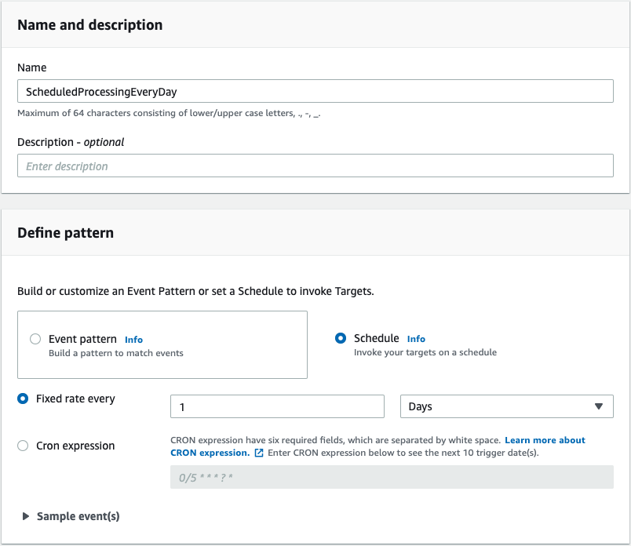
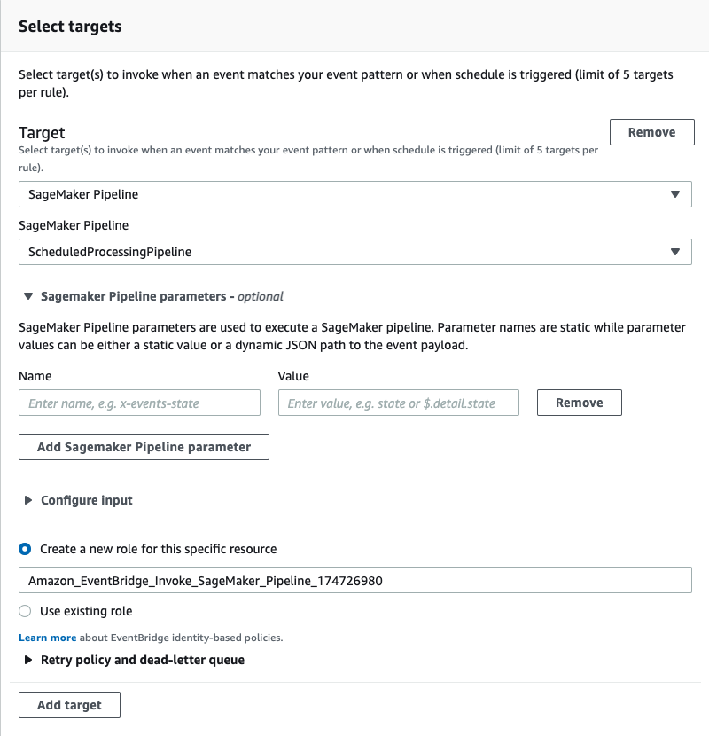

# Scheduling a daily processing job with Amazon SageMaker Processing and Amazon SageMaker Pipelines

The goal of this repository is to showcase one of the possible options to trigger automatically on a schedule the processing of a dataset via Amazon SageMaker Processing. While other options exists, such as calling the Processing job from an AWS Lambda or other form of compute, here the option chosen was to use Amazon SageMaker Pipelines. With SageMaker Pipelines, you can create, automate, and manage end-to-end ML workflows at scale. Using Amazon SageMaker Pipelines, you can create ML workflows with an easy-to-use Python SDK, and then visualize and manage your workflow using Amazon SageMaker Studio. Furthermore, it logs every step of your workflow, creating an audit trail of model components such as training data, platform configurations, model parameters, and learning gradients. 

In order to reproduce the expected behaviour, first run the included [`scheduled-processing` notebook](./scheduled-processing.ipynb). Once that's done, you can come back to this README and follow the next steps to create the schedule via the AWS Management Console. Of course, this can be automated as well by means of code, but for the sake of simplicity, it was chosen to let you do it manually or according to your preferred method of automation (whether it's CDK, SAM or other IaaC).

### Step 1: Run the notebook

In the notebook, you'll learn more about SageMaker Processing, and how to create a SageMaker Pipeline. Once you're done, come back here.

### Step 2: Add the trigger to the Pipeline

Go to [EventBridge Rules](https://eu-west-1.console.aws.amazon.com/events/home?region=eu-west-1#/rules). 

Create a new rule that triggers on your condition - can be an event on the bus or a schedule - and the target is the SageMaker Pipelines that we just created. Choosing Schedule makes this a rule that is triggered regularly on the schedule you specify. You can use a simple fixed-rate schedule that triggers every certain number of minutes, hour, or weeks, or you can use a cron expression to create a more fine-grained schedule, such as “the first Monday of each month at 8am”. In our case, we want this pipeline to be run once a day. 

Once the schedule is set, you can now choose the target of your rule. This specifies what will run once the trigger is activated. We will choose SageMaker Pipelines as our target, and choose the pipeline created in the notebook. If necessary, provide the parameters to the pipeline as well in the corresponding drop-down menu.

Once the target is chosen, you can finally confirm your settings and hit "Create" to create the rule. The scheduler for our pipeline is now complete! It will be triggered in less than one minute, so you can go back to the SageMaker Pipelines visualization in SageMaker Studio to see a new execution being started.

## Security

See [CONTRIBUTING](CONTRIBUTING.md#security-issue-notifications) for more information.

## License

This library is licensed under the MIT-0 License. See the LICENSE file.